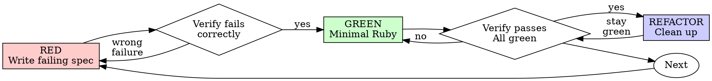

# Test-Driven Development (TDD) Reference

**Load this reference when:** implementing any feature or bugfix in Ruby, writing or changing RSpec specs, adding stubs/doubles, or tempted to add test-only methods to production Ruby code.

**Used by:** skills that produce or modify Ruby code.

## Overview

Write the spec first. Watch it fail with `make test`. Write minimal Ruby to pass. Then run `make lint`.

**Core principle:** If you didn't watch the spec fail, you don't know if it tests the right thing.

**Specs must verify real behavior, not stub behavior. Stubs are a means to isolate, not the thing being tested.**

**Violating the letter of the rules is violating the spirit of the rules.**

## When to Use

**Always:**
- New features
- Bug fixes
- Refactoring
- Behavior changes

**Exceptions (ask your human partner):**
- Throwaway prototypes
- Generated code
- Configuration files

Thinking "skip TDD just this once"? Stop. That's rationalization.

## The Iron Laws

```
1. NO PRODUCTION CODE WITHOUT A FAILING SPEC FIRST
2. NEVER test stub/double behavior
3. NEVER add test-only methods to production classes
4. NEVER stub without understanding dependencies
```

Write code before the spec? Delete it. Start over.

**No exceptions:**
- Don't keep it as "reference"
- Don't "adapt" it while writing specs
- Don't look at it
- Delete means delete

Implement fresh from specs. Period.

## Red-Green-Refactor



### RED — Write Failing Spec

Write one minimal RSpec example showing what should happen.

<Good>
```ruby
RSpec.describe RetryOperation do
  describe '#call' do
    it 'retries failed operations 3 times' do
      attempts = 0
      operation = -> {
        attempts += 1
        raise 'fail' if attempts < 3
        'success'
      }

      result = described_class.new(operation).call

      expect(result).to eq('success')
      expect(attempts).to eq(3)
    end
  end
end
```
Clear name, exercises real behavior, one thing
</Good>

<Bad>
```ruby
RSpec.describe RetryOperation do
  it 'retry works' do
    operation = double('operation')
    allow(operation).to receive(:call).and_return(nil, nil, 'success')
    described_class.new(operation).call
    expect(operation).to have_received(:call).exactly(3).times
  end
end
```
Vague name, tests the double instead of the code
</Bad>

**Requirements:**
- One behavior
- Clear, descriptive `it` string
- Real Ruby (no stubs/doubles unless unavoidable)

### Verify RED — Watch It Fail

**MANDATORY. Never skip.**

```bash
make test
```

To run a single spec file:

```bash
bundle exec rspec spec/path/to/file_spec.rb
```

Confirm:
- Spec fails (not errors out)
- Failure message is what you expected
- Fails because feature missing (not typos, not `NameError`)

**Spec passes?** You're testing existing behavior. Fix the spec.

**Spec errors?** Fix the error, re-run until it fails for the right reason.

### GREEN — Minimal Ruby

Write the simplest Ruby to make the spec pass.

<Good>
```ruby
class RetryOperation
  def initialize(operation)
    @operation = operation
  end

  def call
    attempts = 0
    begin
      attempts += 1
      @operation.call
    rescue
      retry if attempts < 3
      raise
    end
  end
end
```
Just enough to pass
</Good>

<Bad>
```ruby
class RetryOperation
  def initialize(operation, max_retries: 3, backoff: :exponential, on_retry: nil, logger: Rails.logger)
    # YAGNI
  end
end
```
Over-engineered
</Bad>

Don't add features, refactor other code, or "improve" beyond what the spec requires.

### Verify GREEN — Watch It Pass

**MANDATORY.**

```bash
make test
```

Confirm:
- Spec passes
- Other specs still pass
- Output pristine (no errors, deprecation warnings, or unexpected output)

Then:

```bash
make lint
```

Confirm rubocop/standard/etc. pass with no offenses.

**Spec fails?** Fix the code, not the spec.

**Other specs fail?** Fix now.

**`make lint` fails?** Fix offenses now — don't commit lint failures.

### REFACTOR — Clean Up

After green only:
- Remove duplication
- Improve names
- Extract helpers, modules, service objects
- Apply Rails conventions (concerns, scopes, etc.)

Keep specs green. Don't add behavior. Re-run `make test && make lint` after every refactor.

### Repeat

Next failing spec for the next behavior.

## Good Specs

| Quality | Good | Bad |
|---------|------|-----|
| **Minimal** | One thing. "and" in `it` string? Split it. | `it 'validates email and domain and whitespace'` |
| **Clear** | Name describes behavior | `it 'works'` |
| **Shows intent** | Demonstrates desired API | Obscures what code should do |

## Common Rationalizations

| Excuse | Reality |
|--------|---------|
| "Too simple to test" | Simple code breaks. Spec takes 30 seconds. |
| "I'll write specs after" | Specs passing immediately prove nothing. |
| "Specs after achieve same goals" | Specs-after = "what does this do?" Specs-first = "what should this do?" |
| "Already tested in rails console" | Ad-hoc ≠ systematic. No record, can't re-run. |
| "Deleting X hours is wasteful" | Sunk cost fallacy. Keeping unverified code is technical debt. |
| "Keep as reference, write specs first" | You'll adapt it. That's testing after. Delete means delete. |
| "Need to explore first" | Fine. Throw away exploration, start with TDD. |
| "Hard to spec = design unclear" | Listen to the spec. Hard to test = hard to use. |
| "TDD will slow me down" | TDD faster than debugging. Pragmatic = test-first. |
| "rails console test faster" | Console doesn't prove edge cases. You'll re-test every change. |
| "Existing code has no specs" | You're improving it. Add specs for existing code. |
| "Generator scaffolded a spec for me" | Stub specs aren't failing specs. Replace them with real ones first. |

## Testing Anti-Patterns

### Anti-Pattern 1: Testing Stub Behavior

**The violation:**
```ruby
# ❌ BAD: Asserting on the stub itself
RSpec.describe DashboardController, type: :controller do
  it 'renders sidebar' do
    sidebar = instance_double(SidebarComponent)
    allow(SidebarComponent).to receive(:new).and_return(sidebar)
    allow(sidebar).to receive(:render).and_return('<div data-test="sidebar-stub"/>')

    get :show

    expect(response.body).to include('sidebar-stub')
  end
end
```

Why this is wrong: You're verifying the stub renders, not that the controller renders the real sidebar. Spec passes when stub is present, fails when it's not. Tells you nothing about real behavior.

**The fix:**
```ruby
# ✅ GOOD: Test real behavior
RSpec.describe DashboardController, type: :controller do
  it 'renders the sidebar navigation' do
    get :show
    expect(response.body).to have_selector('nav[role="navigation"]')
  end
end

# OR if SidebarComponent must be isolated for speed:
# Don't assert on the stub — test the controller's behavior with sidebar present
```

**Gate function:**
```
BEFORE asserting on any stub/double:
  Ask: "Am I testing real component behavior or just stub existence?"

  IF testing stub existence:
    STOP — Delete the assertion or unstub the dependency

  Test real behavior instead
```

### Anti-Pattern 2: Test-Only Methods in Production

**The violation:**
```ruby
# ❌ BAD: cleanup! only used in specs
class Session < ApplicationRecord
  def cleanup!  # Looks like a production API!
    workspace_manager&.destroy_workspace(id)
    files.destroy_all
  end
end

RSpec.configure do |config|
  config.after(:each) { @session&.cleanup! }
end
```

Why this is wrong: Production model polluted with test-only code. Dangerous if accidentally called from a controller or job. Violates YAGNI and separation of concerns.

**The fix:**
```ruby
# ✅ GOOD: Test utility in spec/support/
# Session has no cleanup! — it's stateless in production

# spec/support/session_cleanup.rb
module SessionCleanup
  def cleanup_session(session)
    return unless session
    workspace = session.workspace_info
    WorkspaceManager.destroy_workspace(workspace.id) if workspace
    Pathname.new(session.scratch_dir).rmtree if Dir.exist?(session.scratch_dir)
  end
end

# spec/spec_helper.rb
RSpec.configure do |config|
  config.include SessionCleanup
  config.after(:each) { cleanup_session(@session) }
end
```

**Gate function:**
```
BEFORE adding any method to a production class:
  Ask: "Is this only used by specs?"
  IF yes: STOP — don't add it; put it in spec/support/ instead
  Ask: "Does this class own this resource's lifecycle?"
  IF no: STOP — wrong class for this method
```

### Anti-Pattern 3: Stubbing Without Understanding

**The violation:**
```ruby
# ❌ BAD: Stub breaks the spec's own setup
RSpec.describe ServerRegistry do
  it 'detects duplicate server' do
    # Stubbing prevents the config write the spec depends on!
    allow(ToolCatalog).to receive(:discover_and_cache_tools)

    described_class.add_server(config)
    expect {
      described_class.add_server(config)
    }.to raise_error(ServerRegistry::DuplicateError)
  end
end
```

Why this is wrong: Stubbed method had a side effect the spec depended on (writing config). Over-stubbing to "be safe" breaks actual behavior. Spec passes for the wrong reason or fails mysteriously.

**The fix:**
```ruby
# ✅ GOOD: Stub at the correct level
RSpec.describe ServerRegistry do
  it 'detects duplicate server' do
    # Stub only the slow external part, preserve behavior the spec needs
    allow(MCPServerManager).to receive(:start)

    described_class.add_server(config)  # Config written
    expect {
      described_class.add_server(config)
    }.to raise_error(ServerRegistry::DuplicateError)
  end
end
```

**Gate function:**
```
BEFORE stubbing any method:
  STOP — Don't stub yet

  1. Ask: "What side effects does the real method have?"
  2. Ask: "Does this spec depend on any of those side effects?"
  3. Ask: "Do I fully understand what this spec needs?"

  IF depends on side effects:
    Stub at a lower level (the actual slow/external operation)
    OR use real objects with test doubles for only the I/O boundary

  IF unsure what the spec depends on:
    Run the spec with real implementation FIRST (make test)
    Observe what actually needs to happen
    THEN add minimal stubbing at the right level

  Red flags:
    - "I'll stub this to be safe"
    - "This might be slow, better stub it"
    - Stubbing without understanding the dependency chain
```

### Anti-Pattern 4: Incomplete Doubles

**The violation:**
```ruby
# ❌ BAD: Partial double — only the keys you think you need
mock_response = double('response',
  status: 'success',
  data: { user_id: '123', name: 'Alice' }
  # Missing: metadata that downstream code uses
)

# Later: NoMethodError when code calls response.metadata.request_id
```

Why this is wrong: Partial doubles hide structural assumptions. Downstream code may depend on fields you didn't include. Spec passes but integration fails.

**The fix:**
```ruby
# ✅ GOOD: Mirror real API completeness; prefer verifying doubles
mock_response = instance_double(ApiResponse,
  status: 'success',
  data: { user_id: '123', name: 'Alice' },
  metadata: { request_id: 'req-789', timestamp: 1_234_567_890 }
)
```

**Gate function:**
```
BEFORE creating a double:
  1. Examine the real class or API response
  2. Include ALL attributes the system might consume downstream
  3. Verify the double matches the real interface
  4. Prefer instance_double / class_double — they fail loudly on missing methods

  If uncertain: use the real object, or include all documented attributes
```

### Anti-Pattern 5: Specs as Afterthought

Specs are part of implementation, not optional follow-up. Can't claim complete without `make test` and `make lint` passing.

```
TDD cycle:
1. Write failing spec
2. Implement to pass (make test)
3. make lint
4. Refactor (still green)
5. THEN claim complete
```

### When Doubles Become Too Complex

Warning signs:
- Stub setup longer than the spec body
- Stubbing everything to make the spec pass
- Doubles missing methods the real class has
- Spec breaks when the double changes

Consider: Request specs / system specs with real Rails components are often simpler than complex doubles. Use FactoryBot for real ActiveRecord instances instead of stubbing model methods.

## Verification Checklist

Before marking work complete:

- [ ] Every new class/method has a spec
- [ ] Watched each spec fail before implementing
- [ ] Each spec failed for expected reason (feature missing, not typo)
- [ ] Wrote minimal Ruby to pass each spec
- [ ] `make test` passes
- [ ] `make lint` passes
- [ ] Output pristine (no errors, deprecation warnings)
- [ ] Specs use real Ruby (stubs/doubles only if unavoidable)
- [ ] Edge cases and errors covered

Can't check all boxes? You skipped TDD. Start over.

## Red Flags — STOP and Start Over

- Code before spec
- Spec after implementation
- Spec passes immediately
- Can't explain why spec failed
- Specs added "later"
- Rationalizing "just this once"
- "I already tried it in rails console"
- "Specs after achieve the same purpose"
- "It's about spirit not ritual"
- "Keep as reference" or "adapt existing code"
- "Already spent X hours, deleting is wasteful"
- "TDD is dogmatic, I'm being pragmatic"
- "This is different because..."
- Skipped `make lint` to "fix later"
- Assertion checks for `*-stub` / `*-mock` markers
- Methods only called in spec files
- Stub setup is >50% of the spec
- Spec fails when you remove a stub
- Can't explain why a stub is needed
- Stubbing "just to be safe"

**All of these mean: Delete code. Start over with TDD.**

## When Stuck

| Problem | Solution |
|---------|----------|
| Don't know how to spec | Write wished-for API. Write `expect` first. Ask your human partner. |
| Spec too complicated | Design too complicated. Simplify interface. |
| Must stub everything | Code too coupled. Inject dependencies, use service objects. |
| Spec setup huge | Extract to `let`, `before`, factory helpers. Still complex? Simplify design. |
| Generator scaffold spec is empty `pending` | Replace with a real failing spec before touching the model. |

## Quick Reference

| Anti-Pattern | Fix |
|--------------|-----|
| Assert on stub return values | Test real component or unstub it |
| Test-only methods in production | Move to spec/support/ |
| Stub without understanding | Understand dependencies first, stub minimally |
| Incomplete doubles | Mirror real interface completely; prefer `instance_double` |
| Specs as afterthought | TDD — specs first, `make test` && `make lint` before claiming done |
| Over-complex stubs | Use request/system specs with real components |

## Final Rule

```
Production Ruby → spec exists and failed first
Otherwise → not TDD
```

Stubs and doubles are tools to isolate, not things to test.

Workflow per cycle: write spec → `make test` (red) → write code → `make test` (green) → `make lint` → refactor → `make test && make lint` (still green).

No exceptions without your human partner's permission.
