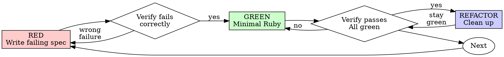

# Test-Driven Development (TDD)

## Overview

Write the spec first. Watch it fail with `make test`. Write minimal Ruby to pass. Then run `make lint`.

**Core principle:** If you didn't watch the spec fail, you don't know if it tests the right thing.

**Violating the letter of the rules is violating the spirit of the rules.**

## When to Use

**Always:**
- New features
- Bug fixes
- Refactoring
- Behavior changes

**Exceptions (ask your human partner):**
- Throwaway prototypes
- Generated code
- Configuration files

Thinking "skip TDD just this once"? Stop. That's rationalization.

## The Iron Law

```
NO PRODUCTION CODE WITHOUT A FAILING SPEC FIRST
```

Write code before the spec? Delete it. Start over.

**No exceptions:**
- Don't keep it as "reference"
- Don't "adapt" it while writing specs
- Don't look at it
- Delete means delete

Implement fresh from specs. Period.

## Red-Green-Refactor



### RED - Write Failing Spec

Write one minimal RSpec example showing what should happen.

<Good>
```ruby
RSpec.describe RetryOperation do
  describe '#call' do
    it 'retries failed operations 3 times' do
      attempts = 0
      operation = -> {
        attempts += 1
        raise 'fail' if attempts < 3
        'success'
      }

      result = described_class.new(operation).call

      expect(result).to eq('success')
      expect(attempts).to eq(3)
    end
  end
end
```
Clear name, exercises real behavior, one thing
</Good>

<Bad>
```ruby
RSpec.describe RetryOperation do
  it 'retry works' do
    operation = double('operation')
    allow(operation).to receive(:call).and_return(nil, nil, 'success')
    described_class.new(operation).call
    expect(operation).to have_received(:call).exactly(3).times
  end
end
```
Vague name, tests the double instead of the code
</Bad>

**Requirements:**
- One behavior
- Clear, descriptive `it` string
- Real Ruby (no stubs/doubles unless unavoidable)

### Verify RED - Watch It Fail

**MANDATORY. Never skip.**

```bash
make test
```

To run a single spec file:

```bash
bundle exec rspec spec/path/to/file_spec.rb
```

Confirm:
- Spec fails (not errors out)
- Failure message is what you expected
- Fails because feature missing (not typos, not `NameError`)

**Spec passes?** You're testing existing behavior. Fix the spec.

**Spec errors?** Fix the error, re-run until it fails for the right reason.

### GREEN - Minimal Ruby

Write the simplest Ruby to make the spec pass.

<Good>
```ruby
class RetryOperation
  def initialize(operation)
    @operation = operation
  end

  def call
    attempts = 0
    begin
      attempts += 1
      @operation.call
    rescue
      retry if attempts < 3
      raise
    end
  end
end
```
Just enough to pass
</Good>

<Bad>
```ruby
class RetryOperation
  def initialize(operation, max_retries: 3, backoff: :exponential, on_retry: nil, logger: Rails.logger)
    # YAGNI
  end
end
```
Over-engineered
</Bad>

Don't add features, refactor other code, or "improve" beyond what the spec requires.

### Verify GREEN - Watch It Pass

**MANDATORY.**

```bash
make test
```

Confirm:
- Spec passes
- Other specs still pass
- Output pristine (no errors, deprecation warnings, or unexpected output)

Then:

```bash
make lint
```

Confirm rubocop/standard/etc. pass with no offenses.

**Spec fails?** Fix the code, not the spec.

**Other specs fail?** Fix now.

**`make lint` fails?** Fix offenses now — don't commit lint failures.

### REFACTOR - Clean Up

After green only:
- Remove duplication
- Improve names
- Extract helpers, modules, service objects
- Apply Rails conventions (concerns, scopes, etc.)

Keep specs green. Don't add behavior. Re-run `make test && make lint` after every refactor.

### Repeat

Next failing spec for the next behavior.

## Good Specs

| Quality | Good | Bad |
|---------|------|-----|
| **Minimal** | One thing. "and" in `it` string? Split it. | `it 'validates email and domain and whitespace'` |
| **Clear** | Name describes behavior | `it 'works'` |
| **Shows intent** | Demonstrates desired API | Obscures what code should do |

## Why Order Matters

**"I'll write specs after to verify it works"**

Specs written after code pass immediately. Passing immediately proves nothing:
- Might test wrong thing
- Might test implementation, not behavior
- Might miss edge cases you forgot
- You never saw it catch the bug

Test-first forces you to see the spec fail, proving it actually exercises something.

**"I already manually tested all the edge cases in the rails console"**

Manual testing is ad-hoc. You think you tested everything but:
- No record of what you tested
- Can't re-run when code changes
- Easy to forget cases under pressure
- "It worked when I tried it" ≠ comprehensive

Automated specs are systematic. They run the same way every time via `make test`.

**"Deleting X hours of work is wasteful"**

Sunk cost fallacy. The time is already gone. Your choice now:
- Delete and rewrite with TDD (X more hours, high confidence)
- Keep it and add specs after (30 min, low confidence, likely bugs)

The "waste" is keeping code you can't trust. Working code without real specs is technical debt.

**"TDD is dogmatic, being pragmatic means adapting"**

TDD IS pragmatic:
- Finds bugs before commit (faster than debugging after)
- Prevents regressions (specs catch breaks immediately)
- Documents behavior (specs show how to use code)
- Enables refactoring (change freely, specs catch breaks)

"Pragmatic" shortcuts = debugging in production = slower.

**"Specs after achieve the same goals - it's spirit not ritual"**

No. Specs-after answer "What does this do?" Specs-first answer "What should this do?"

Specs-after are biased by your implementation. You test what you built, not what's required. You verify remembered edge cases, not discovered ones.

Specs-first force edge case discovery before implementing. Specs-after verify you remembered everything (you didn't).

30 minutes of specs after ≠ TDD. You get coverage, lose proof specs work.

## Common Rationalizations

| Excuse | Reality |
|--------|---------|
| "Too simple to test" | Simple code breaks. Spec takes 30 seconds. |
| "I'll write specs after" | Specs passing immediately prove nothing. |
| "Specs after achieve same goals" | Specs-after = "what does this do?" Specs-first = "what should this do?" |
| "Already tested in rails console" | Ad-hoc ≠ systematic. No record, can't re-run. |
| "Deleting X hours is wasteful" | Sunk cost fallacy. Keeping unverified code is technical debt. |
| "Keep as reference, write specs first" | You'll adapt it. That's testing after. Delete means delete. |
| "Need to explore first" | Fine. Throw away exploration, start with TDD. |
| "Hard to spec = design unclear" | Listen to the spec. Hard to test = hard to use. |
| "TDD will slow me down" | TDD faster than debugging. Pragmatic = test-first. |
| "rails console test faster" | Console doesn't prove edge cases. You'll re-test every change. |
| "Existing code has no specs" | You're improving it. Add specs for existing code. |
| "Generator scaffolded a spec for me" | Stub specs aren't failing specs. Replace them with real ones first. |

## Red Flags - STOP and Start Over

- Code before spec
- Spec after implementation
- Spec passes immediately
- Can't explain why spec failed
- Specs added "later"
- Rationalizing "just this once"
- "I already tried it in rails console"
- "Specs after achieve the same purpose"
- "It's about spirit not ritual"
- "Keep as reference" or "adapt existing code"
- "Already spent X hours, deleting is wasteful"
- "TDD is dogmatic, I'm being pragmatic"
- "This is different because..."
- Skipped `make lint` to "fix later"

**All of these mean: Delete code. Start over with TDD.**

## Example: Bug Fix

**Bug:** Empty email accepted on application form

**RED**
```ruby
RSpec.describe ApplicationFormSubmission do
  it 'rejects empty email' do
    result = described_class.new(email: '').submit
    expect(result.error).to eq('Email required')
  end
end
```

**Verify RED**
```bash
$ make test
Failures:
  1) ApplicationFormSubmission rejects empty email
     Failure/Error: expect(result.error).to eq('Email required')
       expected: "Email required"
            got: nil
```

**GREEN**
```ruby
class ApplicationFormSubmission
  Result = Struct.new(:error, keyword_init: true)

  def initialize(email:)
    @email = email
  end

  def submit
    return Result.new(error: 'Email required') if @email.to_s.strip.empty?
    # ...
  end
end
```

**Verify GREEN**
```bash
$ make test
.

Finished in 0.01 seconds
1 example, 0 failures

$ make lint
no offenses detected
```

**REFACTOR**
Extract a validator class if multiple fields need similar checks.

## Verification Checklist

Before marking work complete:

- [ ] Every new class/method has a spec
- [ ] Watched each spec fail before implementing
- [ ] Each spec failed for expected reason (feature missing, not typo)
- [ ] Wrote minimal Ruby to pass each spec
- [ ] `make test` passes
- [ ] `make lint` passes
- [ ] Output pristine (no errors, deprecation warnings)
- [ ] Specs use real Ruby (stubs/doubles only if unavoidable)
- [ ] Edge cases and errors covered

Can't check all boxes? You skipped TDD. Start over.

## When Stuck

| Problem | Solution |
|---------|----------|
| Don't know how to spec | Write wished-for API. Write `expect` first. Ask your human partner. |
| Spec too complicated | Design too complicated. Simplify interface. |
| Must stub everything | Code too coupled. Inject dependencies, use service objects. |
| Spec setup huge | Extract to `let`, `before`, factory helpers. Still complex? Simplify design. |
| Generator scaffold spec is empty `pending` | Replace with a real failing spec before touching the model. |

## Debugging Integration

Bug found? Write a failing spec reproducing it. Follow TDD cycle. Spec proves the fix and prevents regression.

Never fix bugs without a spec.

## Testing Anti-Patterns

When adding stubs/doubles or test-only methods, read @testing-anti-patterns.md to avoid common pitfalls:
- Testing stub behavior instead of real behavior
- Adding test-only methods to production classes
- Stubbing without understanding dependencies

## Final Rule

```
Production Ruby → spec exists and failed first
Otherwise → not TDD
```

Workflow per cycle: write spec → `make test` (red) → write code → `make test` (green) → `make lint` → refactor → `make test && make lint` (still green).

No exceptions without your human partner's permission.
